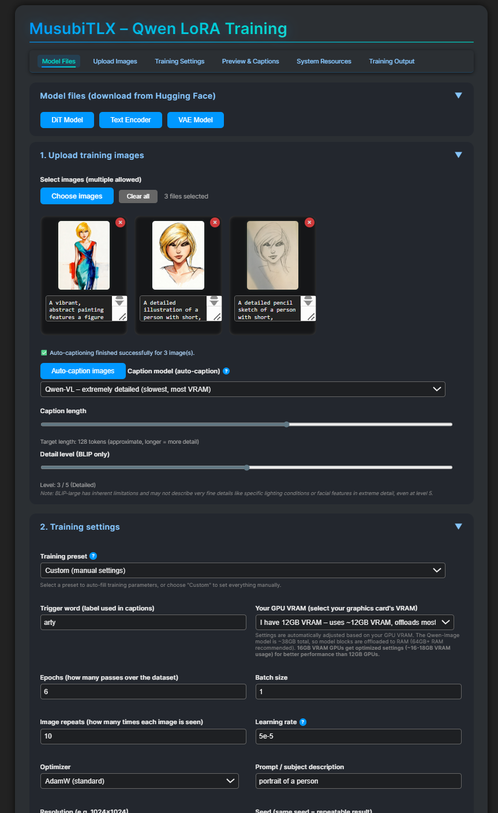

# MusubiTLX – Qwen LoRA Training Web GUI

Simple web GUI for training Qwen-Image LoRA models using [Musubi Tuner](https://github.com/kohya-ss/musubi-tuner).

## What this repo contains

- `webgui.py` – the Flask/Waitress web GUI.
- `MUSUBITLX_GUI.md` – full user guide for the GUI.
- `start_gui.bat` – automated setup and launch script for Windows (recommended for first-time users).
- `start_gui.sh` – automated setup and launch script for Linux/macOS (recommended for first-time users).

> Do **not** copy this README into your Musubi Tuner folder. (Because Musubi-Tuner already have a readme and we dont want to overwrite it ;) ) 
> Only copy the other filer next to your existing `musubi-tuner` installation. Or if you dont have Musubi-tuner installed, just clone this repo to a folder and the installation script will solve everything.

## Installation Options

You have three ways to install and run MusubiTLX GUI:

### Option 1: Automated Setup Scripts (Recommended for First-Time Users)

These scripts automate the entire setup process and are perfect if you're starting from scratch.

#### Windows: `start_gui.bat`

**What it does:**
- Automatically clones the `musubi-tuner` repository if it's not already installed
- Creates a Python virtual environment (`venv`)
- Installs dependencies (PyTorch, torchvision, musubi-tuner)
- Offers to install optional dependencies (ascii-magic, matplotlib, tensorboard, prompt-toolkit)
- Checks for required model files and offers to download them
- Starts the web GUI server

**How to use:**
1. Download or clone this repository
2. Double-click `start_gui.bat` (or run it from Command Prompt)
3. Follow the on-screen prompts
4. The GUI will open automatically at `http://127.0.0.1:5000`

**Requirements:**
- Python 3.10+ installed and in your PATH
- Git installed (for automatic cloning)
- PowerShell (for model downloads)

#### Linux/macOS: `start_gui.sh`

**What it does:**
- Automatically clones the `musubi-tuner` repository if it's not already installed
- Creates a Python virtual environment (`venv`)
- Installs dependencies (PyTorch, torchvision, musubi-tuner)
- Offers to install optional dependencies (ascii-magic, matplotlib, tensorboard, prompt-toolkit)
- Checks for required model files and offers to download them (using curl or wget)
- Starts the web GUI server in background mode (survives SSH disconnects)
- Can run in foreground mode with `./start_gui.sh --fg`

**How to use:**
1. Download or clone this repository
2. Make the script executable: `chmod +x start_gui.sh`
3. Run: `./start_gui.sh`
4. The GUI will be available at `http://0.0.0.0:5000`
5. Use `./start_gui.sh --stop` to stop the server
6. Use `./start_gui.sh --status` to check if it's running

**Requirements:**
- Python 3.10+ installed
- Git installed (for automatic cloning)
- curl or wget (for model downloads)

**Note:** The script automatically uses `nohup` to run the server in the background, so it will continue running even if you disconnect from SSH.

### Option 2: Manual Installation (For Advanced Users or Existing Installations)

Use this method if you prefer to control each step manually, or if you already have Musubi Tuner installed.

**Steps:**
1. Clone or install [Musubi Tuner](https://github.com/kohya-ss/musubi-tuner) manually:
   
   git clone https://github.com/kohya-ss/musubi-tuner.git
   cd musubi-tuner
   2. Copy `webgui.py` and `MUSUBITLX_GUI.md` into the `musubi-tuner` directory.

3. Create and activate a virtual environment:
   python -m venv venv
   source venv/bin/activate  # Linux/macOS
   venv\Scripts\activate     # Windows
   4. Install dependencies:
  
   pip install torch torchvision --index-url https://download.pytorch.org/whl/cu124
   pip install -e .
   5. (Optional) Install extra dependencies:
   pip install ascii-magic matplotlib tensorboard prompt-toolkit
   
6. Download required model files from Hugging Face:
   - DiT Model: `qwen_image_bf16.safetensors`
   - VAE Model: `diffusion_pytorch_model.safetensors`
   - Text Encoder (optional): `qwen_2.5_vl_7b.safetensors`

7. Start the GUI:
   python webgui.py
   8. Open `http://127.0.0.1:5000` in your browser.

### Option 3: Use with Existing Musubi Tuner Installation

If you already have Musubi Tuner set up and working:

1. Copy `webgui.py` and `MUSUBITLX_GUI.md` to your existing Musubi Tuner directory.
2. Activate your virtual environment.
3. Ensure all dependencies are installed (see Option 2, steps 4-5).
4. Run: `python webgui.py`
5. Open `http://127.0.0.1:5000` in your browser.

## Which Installation Method Should I Use?

- **Use Option 1 (Automated Scripts)** if:
  - You're installing for the first time
  - You want the easiest setup experience
  - You're not comfortable with manual command-line setup
  - You want automatic dependency and model file handling

- **Use Option 2 (Manual Installation)** if:
  - You prefer full control over each step
  - You want to understand exactly what's being installed
  - You need to customize the installation
  - You're an experienced Python developer

- **Use Option 3 (Existing Installation)** if:
  - You already have Musubi Tuner working
  - You just want to add the GUI
  - You've already set up your Environment

## Requirements

- Python 3.10 or later
- CUDA-capable GPU with 12GB+ VRAM (24GB+ recommended)
- 64GB+ RAM recommended (32GB + swap may work)
- Windows, Linux, or macOS

## Model Files

The automated setup scripts (`start_gui.bat` and `start_gui.sh`) can download required model files for you, or you can download them manually from Hugging Face:

- **Required:**
  - DiT Model: `qwen_image_bf16.safetensors`
  - VAE Model: `diffusion_pytorch_model.safetensors`
  - Text Encoder: `qwen_2.5_vl_7b.safetensors`

## Troubleshooting

- **Virtual environment issues**: Make sure Python 3.10+ is installed and accessible from your PATH or venv.
- **Missing dependencies**: Run `pip install -e .` from the musubi-tuner directory.
- **Model download failures**: You can download models manually from the web GUI after starting the server.
- **Port already in use**: The GUI uses port 5000 by default. Stop any other services using this port.
- **Windows script errors**: Make sure you're running `start_gui.bat` from Command Prompt or by double-clicking it.
- **Linux/macOS permissions**: Make sure `start_gui.sh` is executable: `chmod +x start_gui.sh`

For more detailed information, see [MUSUBITLX_GUI.md](MUSUBITLX_GUI.md).

## Quick Usage

Result in ComfyUI with only trigger word as prompt

